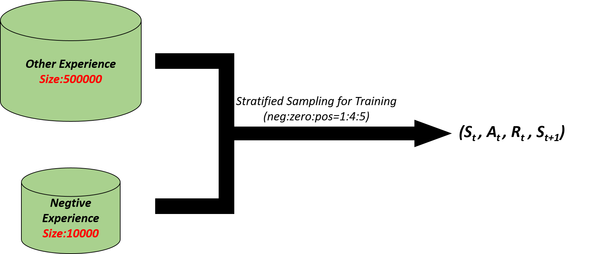

# 基于DQN系列模型训练飞机大战🛩️
## 游戏介绍
游戏来源：https://github.com/yangshangqi/The-Python-code-implements-aircraft-warfare 

游戏详情：通过上下左右调整己方飞机位置，击毁敌方飞机获得分数，碰撞到敌方飞机则游戏结束。每隔一段时间投放强力道具，获取双倍子弹。

## 运行指南📋
### 环境配置
```
pip install tensorflow-gpu==2.10.0
pip install opencv-python
pip install pygame
pip install pyyaml
```
### 运行指南
```
# 训练模型 -config为配置文件 对应configs文件夹下文件
python run.py -config [dqn/ddqn/dueling]
```

## 游戏环境设置🧩
### 奖励设置
|事件    |奖励    |
|:-------|:------|
|击毁小型飞机|1   |
|击毁中型飞机|1.5   |
|击毁大型飞机|2   |
|获取道具    |5   |
|被击毁      |-5   |
|其他        |0   |
### 行为设置
|输入|行为|
|:---|:---|
|0|向左移动|
|1|向右移动|
|2|向上移动|
|3|向下移动|
|4|不动|

## 游戏难点及解决方式🎯
### 模型性能难以估计
游戏不确定因素较多，比较依赖于道具，有一定的运气成分，单局游戏无法反映模型性能。  
解决方式：收集数据阶段让模型进行多局测试，通过平均分估计模型性能，同时增加训练阶段模型训练的step。
### 依赖过去信息
以当前游戏画面作为状态缺少过去的信息，无法做出连贯的动作，导致决策来回晃动。  
解决方式：以当前画面及其过去一段时间的画面的时序状态作为输入。
### 数据分布不平衡
一局游戏有几百到几千帧画面，其中reward为0的约占90%，reward为正数约占10%，reward为负数只有一帧，即游戏结束的状态。reward分布极不平衡，传统的经验池无法高效地存储和利用数据。  
解决方式：将负reward对应的状态单独存储到一个经验池中。同时采用分层采样，按照负样本：0样本：正样本=1：4：5的比率采样。 
### 游戏时间过长
当模型具有一定能力后，完成一局游戏需要1-3分钟左右，而每次测试需要进行100局游戏，测试时间远大于训练时间，训练效率低。
解决方式：测试阶段采用多进程测试，通过管道通讯。主进程将训练好的模型参数通过管道发送给子进程，子进程测试后将数据返回给主进程。

## 模型训练流程🔄
  
使用完全随机的策略测试游戏1000轮，以获取启数据集，然后训练100个epoch。对于每个epoch，先训练3000 个step，在使用训练后的模型测试游戏100轮，并添加到经验池中。为了提高运行效率，测试游戏阶段，使用10个进程并行测试。

## 模型结构(DQN)🏗️

输入数据为时序数据，时序长度为11，包含11张160×160的三通道图片  
通过三次卷积+池化操作，将图片转换为5×5×64的张量  
将每个张量张开成一维数据，经过LSTM层、全连接层，输出每个行为的Q值。

## 数据存储和采样方式🗃️

Reward 为负的样本单独存储在一个经验池中，其他样本存储在一个更大的经验池中。在采样时，按照负样本：0样本：正样本=1：4：5的比率进行分层采样。

## 训练结果📊
以10个进程测试游戏，batch size为128，训练100个epoch用时两天左右。 
#### 训练得分及其分布
  
DQN、Double DQN、Dueling DQN训练过程得分增长相似，均在40轮左右收敛。测试过程中得分的方差都比较大。
#### 训练分数对比
  
训练过程中DQN的分数要越高于其他模型，但在后期模型性能波动较大 。三个模型分数增长趋势基本一致。
#### 模型分数分布对比
  
使用训练过程中，平均分最高的模型分别测试500轮，分数分布如上所示  
相比于其他模型，DQN模型的分数更集中于高分区域。  
人类玩家分数分布呈双峰分布，其中峰值较高的分布与模型测试分布差不多  
三个模型的性能均达到了正常玩家水平，DQN表现最好，甚至略高于人类玩家。